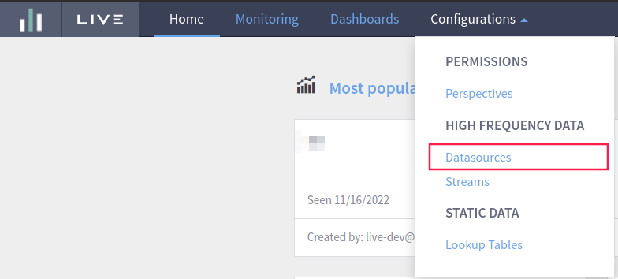
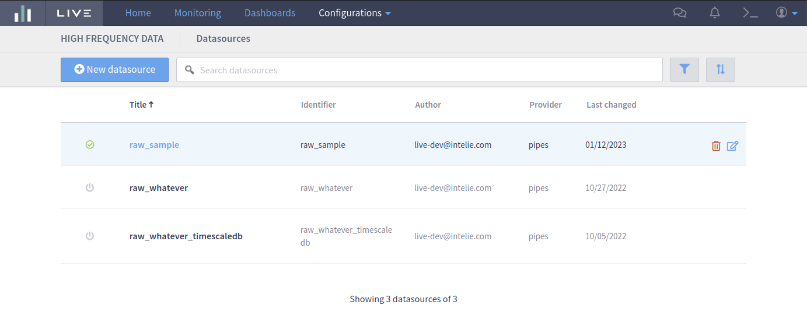
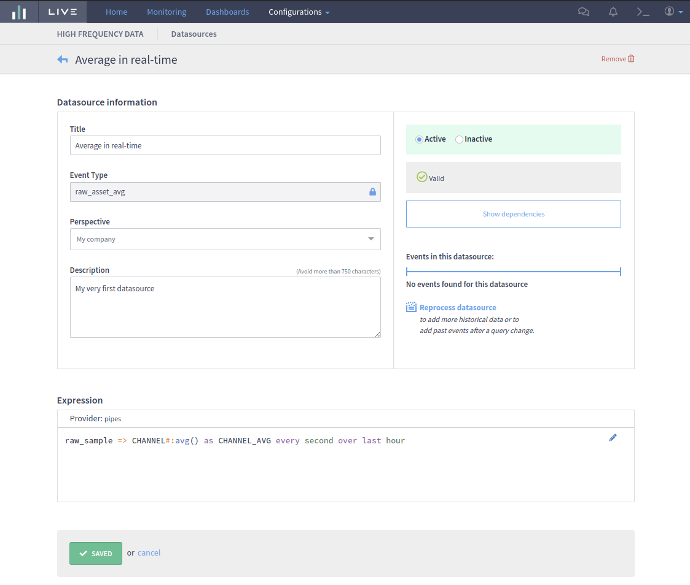

# Datasources

INTELIE Live has a built-in feature to aggregate, enrich or make any processing over the real-time events flow. 
A datasource enables the end-user to create a query using any [query provider](../platform-architecture/introduction.md) available.

The most traditional approach for datasources is to use the [INTELIE Pipes Language](../pipes-queries/introduction.md) for such data processing. However, you can use other query providers such (e.g [Pipes](../pipes-queries/introduction.md), [MongoDB](../featured-plugins/mongodb.md), [SQL](../featured-plugins/sql.md) or create your own query provider to gather data from external sources.

Once a new datasource is created the user can choose a new event type to represent the output of such processing.

A datasource may be attached to some perspective to ensure only users allowed can edit and collaborate on that data processing methodology. 
See more about [Acess Permission](features/access-permision.md).

## Query isolation

INTELIE Live delivers an opt-in feature flag to isolate window advance from all unrelated queries. 

By default, non-datasource queries run their pipes instance in a separate per-query thread, but this mechanism is bypassed for datasource queries, because the ordering of their output relative to the window advance lock is important, since otherwise the events could end up in the wrong window of dependent queries.

To preserve that ordering while also allowing datasource queries to run in a separate per-query thread, each per-query queue is replaced by a linked list of per-window queues. The window corresponding to an event generated by a datasource is propagated to dependent queries through a thread-local side channel, and a window advance which generates no events is propagated to dependent queries through a match on the event type for the datasource.

Each query keeps track of which per-window queues are potentially waiting for events or window advances of its datasource dependencies. In the common case where a query has no datasource dependencies, it can reuse the same queue for all windows, avoiding unnecessary allocations and linked list manipulations.

To enable that opt-in feature flag and make the datasource queries to run in a separated thread, the administrator needs to edit the [live.properties](../administration/configuration/live.properties.md) and change `live.useAsyncDatasourceProvider` to **true**.
